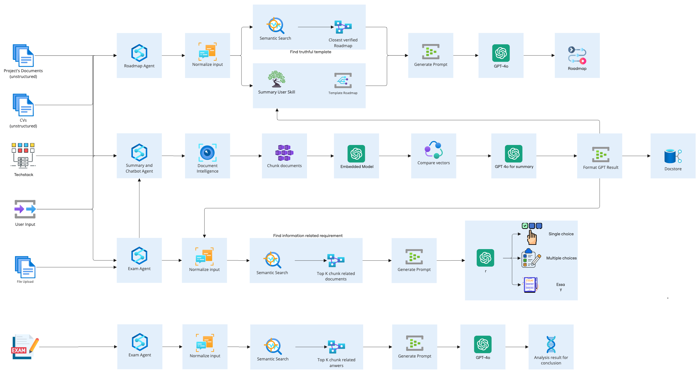

# AI-Exam-API

## Overview
**AI-Exam-API** is an AI Agent API in a comprehensive end-to-end AI solution designed to streamline and enhance organizational training programs. This intelligent ecosystem consists of three specialized agents working in harmony:

1. **Roadmap Agent**: Creates customized learning paths and training roadmaps based on organizational needs and individual skill gaps.

2. **Exam Agent**: Generates tailored assessments, quizzes, and exams that align perfectly with the established roadmaps to evaluate knowledge acquisition.

3. **Document Agent**: Manages, organizes, summaries and retrieves training materials, creating a centralized knowledge repository that supports the entire learning journey.

Together, these interconnected agents form a powerful, cohesive system that guides your team members from initial skill assessment through structured learning paths to final knowledge validation—all powered by advanced AI technology.

The AI-Exam-API is designed for seamless integration with existing learning management systems, providing organizations with intelligent automation tools to make training more effective, personalized, and measurable.


---

## Features
- **Roadmap-Based Exam Generation**: Automatically generate exams by mapping training roadmaps to key learning objectives.
- **Customizable Difficulty Levels**: Customize question difficulty levels to cater to beginner, intermediate, and advanced learners.
- **Content Flexibility**: Generate questions in diverse formats, including multiple-choice, short answers, or descriptive questions.
- **Adaptive Learning Support**: Adjusts exams dynamically based on candidate performance or preset paths.
- **API-Driven Integration**: Seamless integration with training management systems via API allows for automated exam scheduling and member feedback.

---

## Key Benefits
- **Efficient and Scalable**: Automates the time-consuming process of creating detailed exams for every stage of training.
- **Objective-Oriented**: Focuses on what matters by aligning the exams with specific training goals.
- **Personalized Learning**: Delivers tailored content to members, ensuring relevant knowledge areas are thoroughly assessed.
- **Immediate Feedback**: Integrated mechanisms for automated grading and feedback for faster decision-making.

---

## How It Works
1. **Define the Roadmap**: A well-structured training roadmap outlining key modules, skills, and milestones.
2. **API Interaction**: Input the roadmap into the AI system via the API endpoints.
3. **Generate Questions**: The AI processes the roadmap, analyzes the topics, and formulates exam questions accordingly.
4. **Deliver Exams**: The generated exam can be directly delivered or exported for manual review.
5. **Feedback and Reporting**: Receive programmatic feedback on performance metrics for each exam to guide future learning paths.

---

## Setup & Installation
1. Install required Python packages:
   ```bash
   pip install -r requirements.txt
   ```
2. Run the application:
   ```bash
   python main.py
   ```
   
Ensure your environment supports Python 3.9 or later and that dependencies such as `numpy`, `pandas`, and `scikit-learn` are installed.
## Deploy
   ```bash
   docker run -d \
  --name ai-exam-api \
  -p 8000:8000 \
  -e API_KEY="your_api_key" \
  ai-exam-api:latest
   ```
---

## API Endpoints
| Endpoint                | Method | Description                                  |
|-------------------------|--------|----------------------------------------------|
| `/exams/create`         | POST   | Generate exam questions from a given roadmap |
| `/exams/evaluate`       | GET    | Retrieve performance feedback for users      |

---

## Use Cases
- **Corporate Training**: Automate team assessments during onboarding or training programs.
- **Education**: Generate student exams in line with detailed curricula or learning modules.
- **Ed-Tech Platforms**: Add intelligent exam-building capabilities to learning platforms.

---
Author: HoaiTTT
