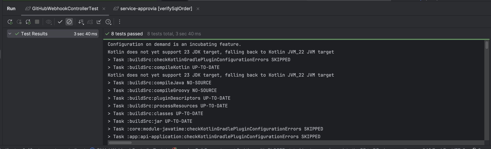

## Summary
- Sync comments related to PR process from Github Event to our database

### Why
- We need sync up comments between GitHub and our application.

### What
- Add Comment Model, Repository
- Handle PR Review Comment Event 
- Handle PR Review Thread Event
- Handle Issue Comment Event
    

### Solution
- Create a new `Comment` model to store comments
- Create a new `CommentRepository` to handle database operations
- Implement event handlers for:
  - `PullRequestReviewCommentEvent`
  - `PullRequestReviewThreadEvent`
  - `IssueCommentEvent`
- Update webhook consumer to process these events and store comments in the database

## Types of Changes
<!--- What types of changes does your code introduce? Put an `x` in all the boxes that apply --->

- [ ] ❌ Breaking change (fix or feature that would cause existing functionality to not work as expected)
- [x] 🚀 New feature (non-breaking change which adds functionality)
- [ ] 🕷 Bug fix (non-breaking change which fixes an issue)
- [ ] 👏 Performance optimization (non-breaking change which addresses a performance issue)
- [ ] 🛠 Refactor (non-breaking change which does not change existing behavior or add new functionality)
- [ ] 📗Library update (non-breaking change that will update one or more libraries to newer versions)
- [ ] 📝 Documentation (non-breaking change that doesn't change code behavior, can skip testing)
- [x] ✅ Test (non-breaking change related to testing)
- [ ] 🔒 Security awareness (changes that effect permission scope, security scenarios)

## Test Plan
<!--- Please input steps on how to test this PR, including evidence in the form of captured images or videos. If this is not necessary, provide the reason why. --->
Dev Test: 

## Checklist:
- [x] I have performed a self-review of my own code
- [x] I have tested that the feature or bug fix works as expected
- [ ] I have included helpful comments, particularly in hard-to-understand areas
- [x] I have added tests that prove my changes are functioning
- [x] New and existing unit tests pass locally with my changes

## Related Issues
<!--- Add a reference section for management tickets, and relevant conversations. --->

ref [APR-465: BE: Sync comment to our database](https://linear.app/c0x12c/issue/APR-465/be-sync-comment-to-our-database)